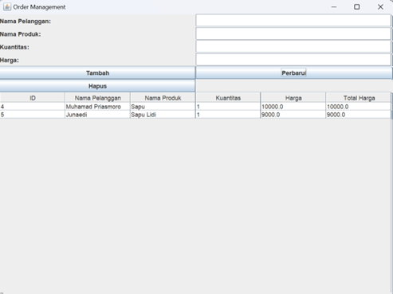

# 🌐 Portfolio Website

**Personal Portfolio & Web Development Showcase**

<div align="center">
  
  
  
  
</div>

## 🚀 Live Demo

**🔗 [Visit My Portfolio](https://thrymst.github.io/portfolio-website/)**

### E-Commerce Website Screenshots

<div align="center">
    <p>📸 Home Page</p>
  
    <p>📸 Login Page</p>
  
  <p>📸 Register Page</p>
  
    <p>📸 Product List</p>
  
      <p>📸 Product Page</p>
  
    <p>📸 Keranjang Page</p>
  
    <p>📸 Payment Page</p>
  
  <p>📸 Invoice Page</p>
  
    <p>📸 Invoice List Page</p>
  
      <p>📸 Admin Page</p>
  
    <p>📸 Adding Product Page</p>
  
    <p>📸 Edit Product Page</p>
  
</div>

### Order Management System Screenshot
**🔗 [Visit The Code](https://github.com/Thrymst/Ujian_RPL2)**
<div align="center">
    <p>📸 Main Page</p>
  
    <p>📸 Create Order</p>
  
  <p>📸 Update Order 1</p>
  
    <p>📸 Update Order 2</p>
  
      <p>📸 Delete Order 1</p>
  
    <p>📸 Delete Order 2</p>
  
    <p>📸 Database Order</p>
  
</div>

### Worker Management Screenshots
**🔗 [Visit The Code](https://github.com/Thrymst/Project-Praktikum-Pweb)**
<div align="center">
    <p>📸 Login Page</p>
  
    <p>📸 Dashboard Page</p>
  
  <p>📸 Adding Worker Page</p>
  
    <p>📸 Adding Worker Page 2</p>
  
      <p>📸 Edit Worker</p>
  
    <p>📸 Delete Worker Page</p>
  
    <p>📸 Delete Worker Page 2</p>
  
</div>

### Frontend
- **HTML5**: Semantic markup and structure
- **CSS3**: Advanced styling with Flexbox and Grid
- **JavaScript ES6**: Interactive functionality and DOM manipulation
- **CSS Animations**: Smooth transitions and hover effects

### Backend (for contact form)
- **MySQL**: Database for storing contact form submissions
- **PHP**: Server-side processing for form handling

### Tools & Libraries
- **Font Awesome**: Icons and visual elements
- **Google Fonts**: Custom typography
- **AOS (Animate On Scroll)**: Scroll-triggered animations
- **Typed.js**: Typing animation effects

## 📁 Project Structure

<div align="center">
    <p>📸 Activity Diagram</p>
  
    <p>📸 Struktur Navigasi</p>
  
  <p>📸 Struktur Navigasi Customer</p>
  
</div>


## 🎯 Key Sections

### 1. **Hero Section**
- Professional introduction with typing animation
- Call-to-action buttons
- Social media links

### 2. **About Me**
- Personal introduction and background
- Skills and competencies
- Education and interests

### 3. **Projects Portfolio**
- Interactive project gallery
- Detailed project descriptions
- Technology stack for each project
- Live demo and GitHub links

### 4. **Skills & Expertise**
- Technical skills with progress bars
- Programming languages proficiency
- Tools and frameworks experience

### 5. **Contact**
- Working contact form
- Social media integration
- Location and availability information

## 🚀 Getting Started

### Prerequisites
- Web browser (Chrome, Firefox, Safari, Edge)
- Local web server (optional, for PHP functionality)
- MySQL database (for contact form)

### Installation

1. **Clone the repository**
```bash
git clone https://github.com/Thrymst/portfolio-website.git
cd portfolio-website
```

2. **For local development**
```bash
# Using Python (simple HTTP server)
python -m http.server 8000

# Using Node.js (if you have http-server installed)
npx http-server

# Using PHP (if you have PHP installed)
php -S localhost:8000
```

3. **Set up database (for contact form)**
```sql
-- Import the database schema
mysql -u username -p database_name < database/contact_form.sql
```

## 📱 Responsive Design

The website is fully responsive and tested on:
- ✅ Desktop (1920px and above)
- ✅ Laptop (1024px - 1919px)
- ✅ Tablet (768px - 1023px)
- ✅ Mobile (320px - 767px)

## 📞 Contact

If you have any questions about this project or want to collaborate:

- **Email**: samandias88@gmail.com
- **LinkedIn**: [linkedin.com/in/junaediamandias](https://linkedin.com/in/junaediamandias)
- **GitHub**: [github.com/Thrymst](https://github.com/Thrymst)

## 📄 License

This project is open source and available under the [MIT License](LICENSE).

## 🙏 Acknowledgments

- **Design Inspiration**: Various modern portfolio websites
- **Icons**: Font Awesome
- **Fonts**: Google Fonts
- **Animations**: AOS Library
- **Community**: Stack Overflow and GitHub community

---
## Contributors

<table>
  <tr>
    <td align="center">
      <a href="https://github.com/mozartfelix">
        
        <br />
        <sub><b>Mozart Felix</b></sub>
      </a>
      <br />
      <a href="#" title="Code">💻</a> <a href="#" title="Documentation">📖</a>
    </td>
  </tr>
</table>
<div align="center">
  <h3>⭐ If you found this project helpful, please give it a star!</h3>
  <p>Made with ❤️ by <a href="https://github.com/Thrymst">Junaedi Samandias</a></p>
</div>
